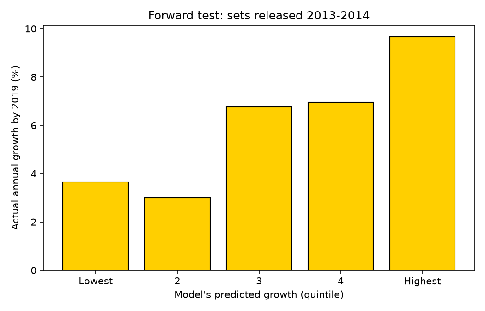

# 🧱 LEGO Set Value Predictor

**Can you tell, on the day a LEGO set is released, whether it will be a good investment?**

This project predicts how fast a sealed LEGO set will grow in value, using only information
available on release day: theme, piece count, retail price, minifigures, and whether it's a
licensed franchise. It's trained on eBay resale prices for 1,800+ sets from a dataset published
alongside peer-reviewed research on LEGO as an alternative investment.

**Live app:** https://lego-value-predictor-aymogxuhjfo59dhzhmhsid.streamlit.app/

## Key results
The real test: the model was trained only on sets released through 2012, then used to predict
sets released in **2013-2014** (which were still in stores, with no resale history) and checked
against what those sets actually sold for in **2019**.



- The sets the model ranked in its **top fifth grew about 9.4% per year**, versus about **3.6%**
  for its bottom fifth, roughly 2.6x faster. Across all 456 test sets, average growth was 6.0%.
- Its top 10% of picks grew 9.8% per year on average.
- Rank correlation between predicted and actual growth: **0.27**.
- **Honest limitation:** the model is much better at *ranking* sets than at predicting exact
  growth rates. It overestimated the overall level for the 2013-2014 sets (predicting ~12% per
  year on average versus 6% actual), likely because the LEGO resale market cooled between 2015
  and 2019. That shift shows up as a negative R² on the forward test even though the ranking holds.

Full numbers are in `reports/metrics.json`.

## Approach
1. **Data.** 2,322 sets with retail prices, themes, piece counts, minifigures, and average eBay
   sold prices (sealed) in Dec 2015, plus monthly prices from Jan 2018 to Apr 2019.
2. **Target.** Annual growth rate since release:
   `(resale price / retail price) ^ (1 / years since release) − 1`.
   Annualizing makes a 2003 set and a 2011 set comparable.
3. **Features (release-day only).** Theme, licensed vs. original, log piece count, log price,
   price per piece, minifigures, minifigures per 100 pieces, size group, and the holding period
   (how many years after release you want the prediction for). Holding period matters because
   sets usually sell below retail while still in stores and only climb after they retire.
4. **Three-way time-based split.**
   Train on sets from 1995-2009, pick the model on 2010-2012 sets, then run a single forward test
   on 2013-2014 sets using 2019 prices. A random split would let the model "see the future."
5. **Baselines first.** Every model is compared against a global-median and a theme-average
   baseline. Gradient boosting beat Ridge regression and both baselines on validation.
6. **Metrics that match the use case.** Beyond MAE and R², the project reports rank correlation
   and the actual growth of the model's top picks, since a collector mainly wants to know which
   sets to buy.

## Findings
- Smaller sets and certain themes appreciated fastest in this sample; heavily produced,
  mid-sized Star Wars sets from 2009-2012 grew slowly by 2015.
- See `reports/feature_importance.png` and `reports/growth_by_theme.png` for details.

## Run it yourself
```bash
python3 -m venv venv && source venv/bin/activate
pip install -r requirements.txt
python3 src/build_dataset.py   # load Excel files, compute target and features
python3 src/train.py           # train, validate, forward test, save model and plots
streamlit run app.py           # launch the app
```

## Project structure
```
data/raw/               the two Excel files from Mendeley Data
src/build_dataset.py    clean data, compute target and features -> data/processed/
src/train.py            baselines, models, validation, forward test, plots -> models/, reports/
app.py                  Streamlit web app
```

## Limitations
- Prices end in 2019 and are nominal dollars, not inflation-adjusted.
- The 2015 sample comes from a collector's price guide, which focused on major themes and notable
  sets, so it isn't a random sample of all LEGO sets.
- Release month and retirement dates aren't in the data, so release is assumed to be mid-year.
- Resale values come from eBay sold listings only.

## Data source
Dobrynskaya, V. (2021). *LEGO secondary market price data*. Mendeley Data, V1.
doi:10.17632/v9hhs66vm3.1. Related paper: Dobrynskaya, V. & Kishilova, J. (2022), "LEGO: The
Toy of Smart Investors," *Research in International Business and Finance*.

LEGO® is a trademark of the LEGO Group, which does not sponsor or endorse this project.
